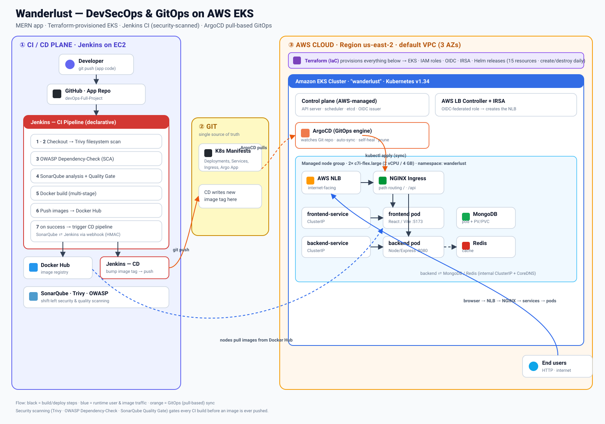
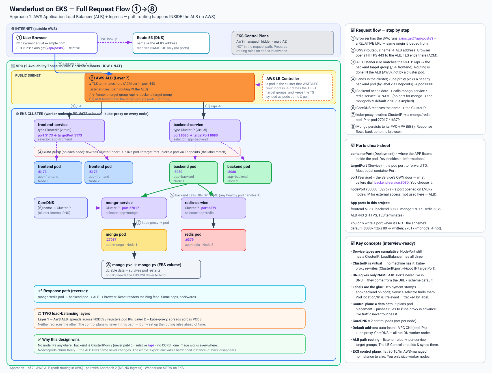
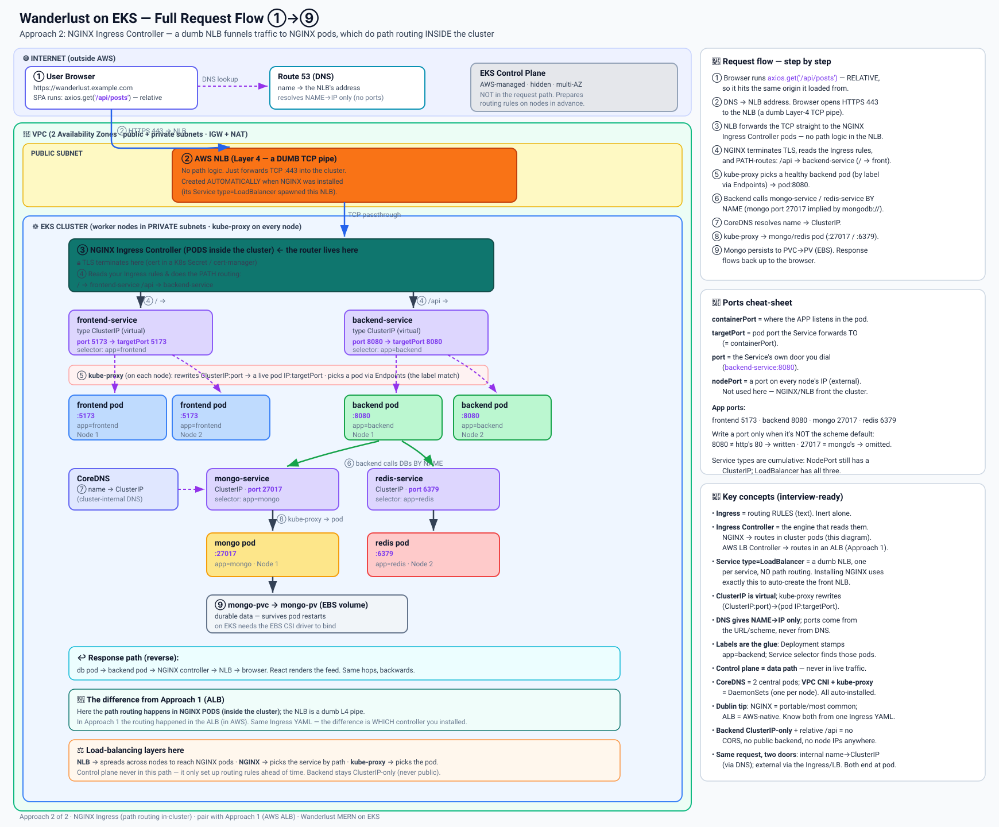
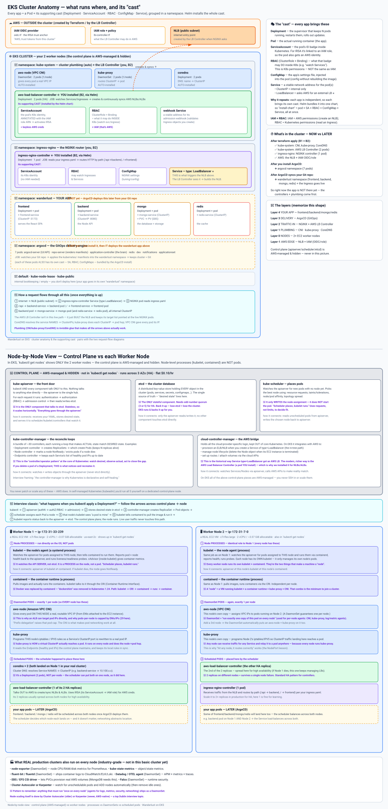
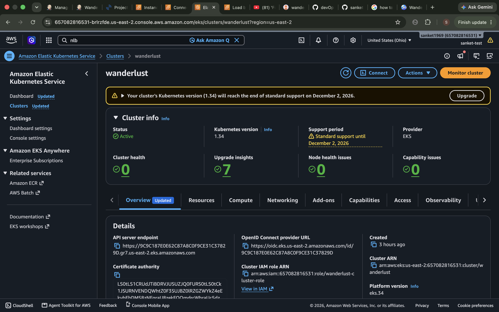
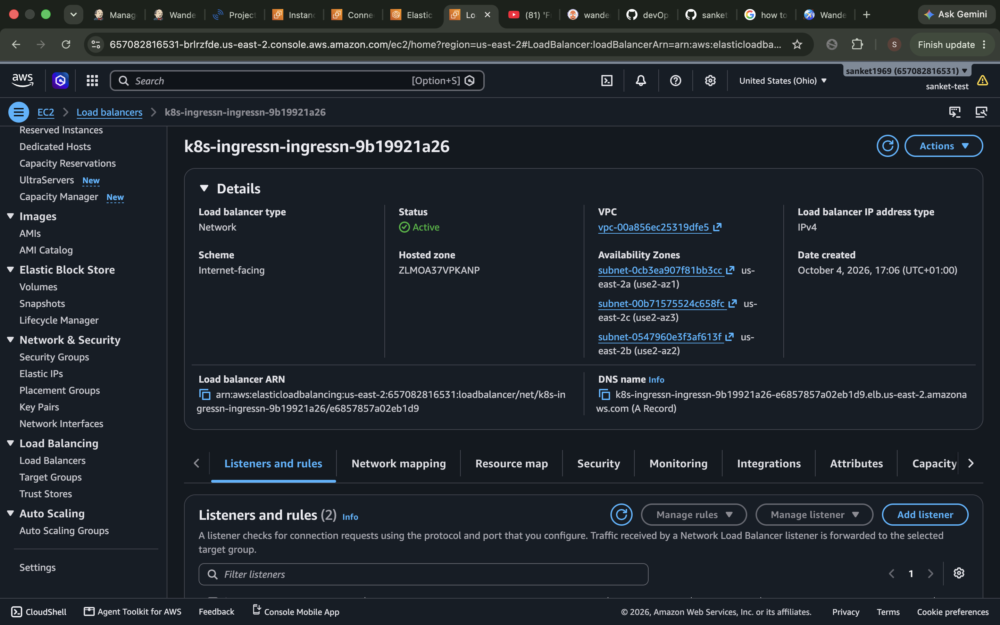
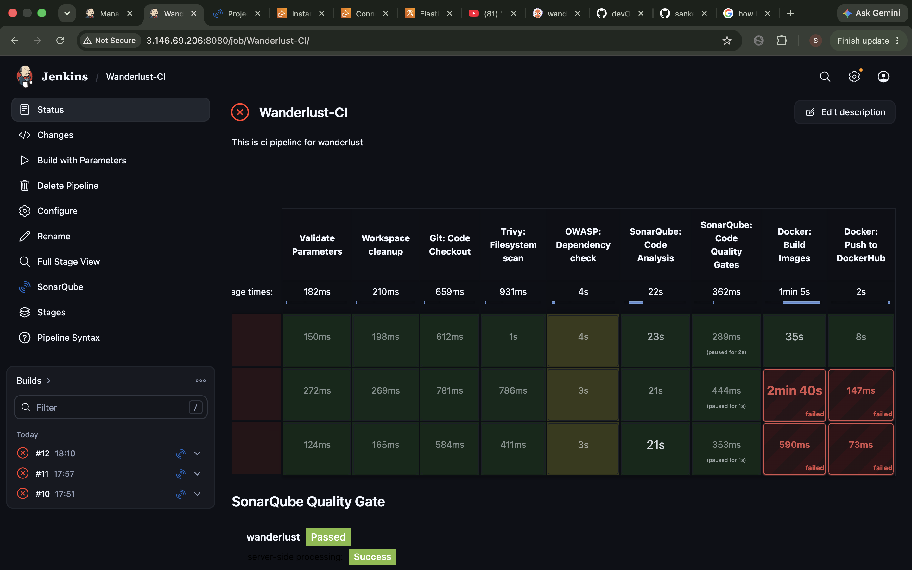
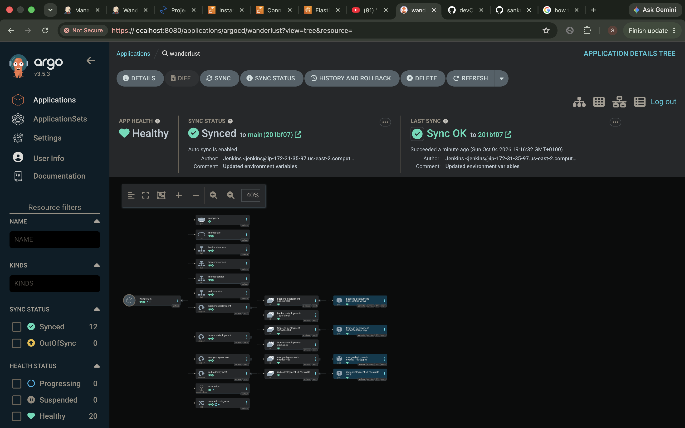
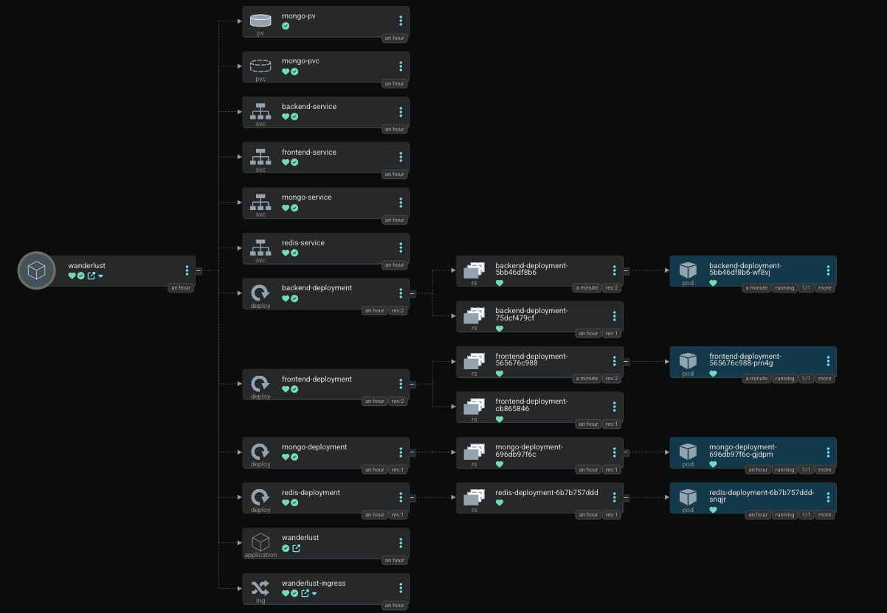
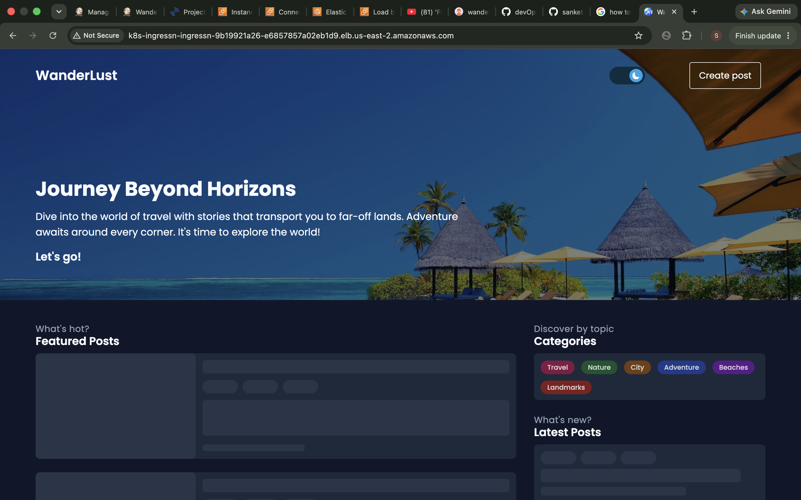

<div align="center">

# 🌍 Wanderlust — End-to-End DevSecOps & GitOps on AWS EKS

**A MERN travel-blog application shipped through a complete, production-shaped DevSecOps pipeline:
infrastructure as code with Terraform, security-scanned CI with Jenkins, and pull-based GitOps delivery with ArgoCD — all running on Amazon EKS.**


</div>

---

## 📖 Overview

Wanderlust is a full **MERN** (MongoDB · Express · React · Node.js) travel blog. This repository takes that
application from source code to a running workload on **Amazon EKS** through an automated, security-gated pipeline:

- **Infrastructure as Code** — the entire EKS platform (cluster, nodes, IAM, OIDC/IRSA, ingress, GitOps engine)
  is provisioned by **Terraform**, so it can be created and destroyed on demand for cost control.
- **DevSecOps CI** — **Jenkins** builds the app only after it passes **Trivy**, **OWASP Dependency-Check**, and a
  **SonarQube Quality Gate** (shift-left security & quality).
- **GitOps CD** — **ArgoCD** continuously pulls Kubernetes manifests from Git and keeps the cluster in sync,
  so Git is the single source of truth and CI never holds cluster credentials.

---

## 🏗️ Architecture

<div align="center">



</div>

**The three planes:**

| Plane | What happens |
|-------|--------------|
| **① CI / CD (Jenkins on EC2)** | Checkout → Trivy → OWASP → SonarQube + Quality Gate → multi-stage Docker build → push to Docker Hub → trigger CD, which bumps the image tag in Git. |
| **② Git (source of truth)** | Kubernetes manifests (Deployments, Services, Ingress, ArgoCD Application). CD writes the new image tag here. |
| **③ AWS Cloud / EKS (Terraform-provisioned)** | ArgoCD pulls from Git and syncs the cluster. Users reach the app via **NLB → NGINX Ingress → ClusterIP Services → pods**; backend talks to MongoDB/Redis internally. |

**Flow legend:** ⬛ build/deploy steps · 🟦 runtime user & image traffic · 🟧 GitOps (pull-based) sync.

---

## 🧰 Tech Stack

| Category | Technologies |
|----------|--------------|
| **Cloud / AWS** | EKS, EC2, IAM, **OIDC + IRSA**, VPC, Subnets, Security Groups, Network Load Balancer |
| **IaC** | Terraform (aws, tls, kubernetes, helm, http providers; `helm_release`, data sources, `depends_on`) |
| **Containers & Orchestration** | Docker (multi-stage), Docker Hub, Kubernetes, Helm |
| **CI / CD** | Jenkins (declarative pipeline, shared library), ArgoCD (GitOps, auto-sync, self-heal, prune) |
| **Ingress / Networking** | NGINX Ingress Controller, AWS Load Balancer Controller, ClusterIP services, path-based routing |
| **Security (DevSecOps)** | Trivy, OWASP Dependency-Check, SonarQube (SAST + Quality Gates), webhook HMAC, least-privilege IRSA |
| **Application** | Node.js, Express, React, Vite, TypeScript, MongoDB, Redis, Jest |
| **OS / Tooling** | Linux (Ubuntu / Amazon Linux 2023), Bash, kubectl, aws-cli, Git/GitHub |

---

## 🔄 How It Works

### CI pipeline (Jenkins)
1. **Validate parameters** & **workspace cleanup**
2. **Git checkout**
3. **Trivy** filesystem scan (vulnerabilities / secrets)
4. **OWASP Dependency-Check** (software composition analysis)
5. **SonarQube** code analysis (SAST)
6. **SonarQube Quality Gate** — pipeline **aborts** if it fails (webhook-driven)
7. **Docker build** (multi-stage images for frontend & backend)
8. **Docker push** to Docker Hub
9. On success → **trigger the CD pipeline**

### CD + GitOps (ArgoCD)
1. CD pipeline updates the **image tag** in the Kubernetes manifests in Git and pushes the commit.
2. **ArgoCD** (running inside EKS) detects the Git change and **syncs** the `wanderlust` namespace to match.
3. `prune` + `selfHeal` keep the cluster exactly equal to Git — drift is reverted automatically.

> **Push vs Pull:** Jenkins *pushes* to Git; ArgoCD *pulls* from Git into the cluster. The pipeline never
> holds a kubeconfig, which keeps cluster credentials out of CI.

---

## 📐 Deep-Dive Diagrams

**1 · Request flow — the AWS load-balancer layer**



**2 · Request flow — NGINX Ingress path routing**



**3 · EKS cluster anatomy (namespaces, pods, and per-node layout)**



---

## 📸 Live Proof

**EKS cluster running (AWS Console) — `wanderlust`, Kubernetes v1.34, OIDC + IAM wired**



**Internet-facing Network Load Balancer created by the AWS LB Controller (across 3 AZs)**



**Jenkins CI pipeline — security-scanned stages + SonarQube Quality Gate passed**



**ArgoCD — application `wanderlust` Healthy & Synced (GitOps)**



**ArgoCD resource tree — Deployments → ReplicaSets → Pods, Services, Ingress, PV/PVC**



**The live application served through the NLB → NGINX → frontend**



---

## 📂 Repository Layout

```
Wanderlust-Mega-Project/
├── terraform/            # IaC: EKS, node group, IAM, OIDC, IRSA, Helm releases (LB ctrl, NGINX, ArgoCD)
├── kubernetes/           # K8s manifests: Deployments, Services (ClusterIP), Ingress, ArgoCD Application
├── backend/              # Node.js / Express API (+ multi-stage Dockerfile)
├── frontend/             # React / Vite / TypeScript (+ multi-stage Dockerfile)
├── Jenkinsfile           # CI pipeline
├── GitOps/Jenkinsfile    # CD pipeline (updates image tag in Git)
├── docs/
│   ├── images/           # architecture diagram, deep-dive diagrams, screenshots
│   └── original-app-readme.md   # the upstream application README (kept for reference)
└── README.md
```

---

## 🚀 Deploy / Tear Down

```bash
# 1. Provision the whole EKS platform
cd terraform
terraform init
terraform apply

# 2. Point kubectl at the new cluster
aws eks update-kubeconfig --region us-east-2 --name wanderlust

# 3. Connect ArgoCD to Git (bootstraps the GitOps loop)
kubectl apply -f ../kubernetes/argocd-app.yaml

# 4. Get the public URL (the NLB hostname)
kubectl get ingress -n wanderlust

# …later, to stop all spend:
terraform destroy
```

---

## 🧠 Key Engineering Decisions & Problems Solved

- **Terraform over manual `eksctl`/console** — reproducible, destroyable daily for cost control (15 managed resources).
- **IRSA (IAM Roles for Service Accounts)** — the AWS LB Controller pod assumes an OIDC-federated role; least
  privilege at the **pod** level instead of granting the whole node load-balancer permissions.
- **ClusterIP + Ingress + relative `/api` path** — replaced tutorial-grade NodePort/hardcoded-IP hacks; the
  frontend calls the backend on the same origin, so there are **no hardcoded hosts and no CORS**.
- **Pull-based GitOps** — ArgoCD keeps cluster credentials out of CI and makes Git the single source of truth.
- **AWS NAT hairpinning** — diagnosed SonarQube scanner/webhook timeouts caused by an instance addressing its
  **own public IP**; fixed by using localhost / private IP (`connect timed out` vs `connection refused`).
- **`docker.sock` permissions, image-tag drift, gitignored env files, stale kubeconfig** — root-caused and fixed
  during live pipeline runs.

---

<div align="center">

*Built as a hands-on DevOps learning project — every component was provisioned, broken, debugged, and fixed by hand to understand the mechanism, not just the happy path.*

</div>
